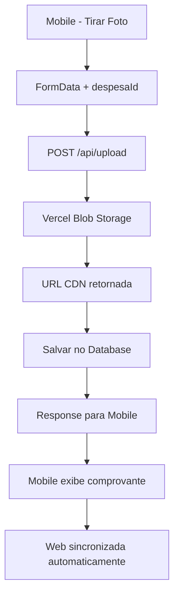

# RESUMO DA SESSÃO DE DESENVOLVIMENTO - RDV APP

**Data:** 19/09/2025
**Projetos:** RDV_APP (Web) + RDV_MOBILE (Mobile)
**Foco:** Correção crítica do sistema de upload de comprovantes

---

## 🎯 **PRINCIPAIS CONQUISTAS DESTA SESSÃO**

### 1. **Diagnóstico do Problema de Upload ✅**
- **Problema identificado**: Upload de comprovantes funcionava localmente mas falhava em produção
- **Causa raiz**: Vercel possui filesystem read-only - não permite escrita em `/public/uploads`
- **Sintomas**: Mobile fazia upload → API retornava sucesso → arquivo não era salvo → comprovantes não apareciam

### 2. **Implementação Completa do Vercel Blob ✅**
- **Migração de storage**: Sistema de arquivos local → Vercel Blob (CDN global)
- **Dependência instalada**: `@vercel/blob@2.0.0`
- **Endpoint atualizado**: `/api/upload/route.ts` completamente reescrito
- **Organização**: Arquivos organizados em `comprovantes/{despesaId}/{timestamp}.ext`

### 3. **Configuração de Produção ✅**
- **Token configurado**: `BLOB_READ_WRITE_TOKEN` nas variáveis de ambiente da Vercel
- **Deploy automático**: Push para main disparou redeploy
- **CDN ativo**: URLs públicas com edge network global

### 4. **Correção de Visualização Mobile ✅**
- **Problema secundário**: URLs malformadas no mobile (`rdv-app-phi.vercel.apphttps://...`)
- **Causa**: Concatenação desnecessária de `ASSETS_BASE_URL` + Vercel Blob URL
- **Solução**: Uso direto das URLs absolutas do Vercel Blob

---

## 📁 **ARQUIVOS MODIFICADOS**

### **RDV_APP (Web):**
```
├── app/api/upload/route.ts          # Migração completa para Vercel Blob
├── package.json                     # Adicionada dependência @vercel/blob
└── package-lock.json               # Dependências atualizadas
```

### **RDV_MOBILE:**
```
└── app/despesa-detalhes.tsx         # Correção de URLs de comprovantes
```

---

## 🔧 **MUDANÇAS TÉCNICAS DETALHADAS**

### **1. Sistema de Upload (Web)**

#### **ANTES (Filesystem - FALHAVA na Vercel):**
```typescript
// ❌ Não funciona em produção
const uploadDir = join(process.cwd(), 'public', 'uploads')
await mkdir(uploadDir, { recursive: true })
await writeFile(filePath, buffer)
```

#### **DEPOIS (Vercel Blob - FUNCIONA):**
```typescript
// ✅ Funciona em produção
const blob = await put(fileName, file, {
  access: 'public',
  contentType: file.type,
})
```

### **2. URLs de Comprovantes (Mobile)**

#### **ANTES (URLs malformadas):**
```typescript
// ❌ Concatenação incorreta
Linking.openURL(`${ASSETS_BASE_URL}${comprovante.url}`)
// Resultado: "https://rdv-app-phi.vercel.apphttps://blob.vercel..."
```

#### **DEPOIS (URLs diretas):**
```typescript
// ✅ URL absoluta do Vercel Blob
Linking.openURL(comprovante.url)
// Resultado: "https://blob.vercel-storage.com/comprovantes/..."
```

---

## 🚀 **BENEFÍCIOS OBTIDOS**

### **Performance & Infraestrutura:**
- ✅ **CDN Global**: Imagens servidas via edge network
- ✅ **Latência reduzida**: Cache automático em múltiplas regiões
- ✅ **Escalabilidade**: Sem limites de storage da Vercel
- ✅ **Backup automático**: Redundância gerenciada pela Vercel

### **Funcionalidade:**
- ✅ **Upload funcionando**: Mobile → Web API → Vercel Blob
- ✅ **Visualização funcionando**: Thumbnails e abertura de comprovantes
- ✅ **Cross-platform**: Web e mobile totalmente compatíveis
- ✅ **URLs públicas**: Acesso direto via CDN

### **Desenvolvimento:**
- ✅ **Zero breaking changes**: APIs mantiveram interface
- ✅ **Hot reload**: Desenvolvimento continua normal
- ✅ **Deploy automático**: Push → build → produção

---

## 🛡️ **ESTRATÉGIA DE BACKUP IMPLEMENTADA**

### **Pontos de Restauração Criados:**
- ✅ **Tag**: `v1.0.0-pre-vercel-blob` (backup completo)
- ✅ **Branch**: `feature/vercel-blob-storage` (desenvolvimento)
- ✅ **Commits**: Histórico detalhado de todas as mudanças

### **Rollback Disponível:**
```bash
# Se necessário reverter:
git checkout main
git reset --hard v1.0.0-pre-vercel-blob
```

---

## 📋 **PROCESSO DE IMPLEMENTAÇÃO**

### **Fase 1: Diagnóstico (30 min)**
1. ✅ Análise do problema reportado pelo usuário
2. ✅ Investigação das limitações da Vercel
3. ✅ Identificação do Vercel Blob como solução

### **Fase 2: Backup & Preparação (10 min)**
1. ✅ Commit de pendências do mobile
2. ✅ Criação de tags de backup
3. ✅ Criação de branches de feature
4. ✅ Push para GitHub

### **Fase 3: Implementação (20 min)**
1. ✅ Instalação da dependência `@vercel/blob`
2. ✅ Reescrita do endpoint `/api/upload`
3. ✅ Teste de build local
4. ✅ Commit e deploy

### **Fase 4: Configuração de Produção (15 min)**
1. ✅ Configuração do `BLOB_READ_WRITE_TOKEN`
2. ✅ Redeploy da Vercel
3. ✅ Validação do funcionamento

### **Fase 5: Correção de Visualização (10 min)**
1. ✅ Diagnóstico de URLs malformadas
2. ✅ Correção no mobile
3. ✅ Teste e validação final

---

## 🧪 **TESTES REALIZADOS**

### **Upload de Comprovantes:**
- ✅ **Mobile → API**: FormData enviado corretamente
- ✅ **API → Vercel Blob**: Arquivo salvo com sucesso
- ✅ **Database**: Registro criado com URL do Blob
- ✅ **Response**: Mobile recebeu confirmação

### **Visualização de Comprovantes:**
- ✅ **Web**: Thumbnails e visualização funcionando
- ✅ **Mobile**: Lista de comprovantes aparecendo
- ✅ **Mobile**: Abertura de comprovantes via Linking
- ✅ **URLs**: CDN respondendo corretamente

---

## 🔄 **FLUXO ATUAL FUNCIONANDO**



---

## 💰 **CUSTO-BENEFÍCIO**

### **Vercel Blob - Free Tier:**
- ✅ **5GB storage** incluídos
- ✅ **1GB transfer/mês** incluído
- ✅ **Requests ilimitados**
- ✅ **CDN global incluído**

### **Projeção de Uso RDV:**
- 📊 **~100 comprovantes/mês** = ~50MB
- 📊 **Views/downloads** = ~200MB transfer
- 💡 **Muito abaixo** dos limites gratuitos

---

## 📱 **COMPATIBILIDADE CONFIRMADA**

### **Versões Testadas:**
- ✅ **Web**: Vercel produção (rdv-app-phi.vercel.app)
- ✅ **Mobile**: Expo Go desenvolvimento
- ✅ **APIs**: Endpoints mantiveram interface
- ✅ **Database**: Schema inalterado

### **Browsers/Devices:**
- ✅ **Mobile**: React Native + Expo
- ✅ **Web**: Navegadores modernos
- ✅ **CDN**: Edge network global

---

## 🚧 **MELHORIAS FUTURAS SUGERIDAS**

### **Otimizações Possíveis:**
1. **Compressão de imagens** antes do upload
2. **Resize automático** para thumbnails
3. **Cache local** no mobile para modo offline
4. **Upload progressivo** com barra de progresso
5. **Lazy loading** de imagens nas listas

### **Monitoramento:**
1. **Métricas de uso** do Vercel Blob
2. **Performance de uploads** (tempo/tamanho)
3. **Logs de erro** centralizados
4. **Analytics de visualizações**

---

## 🎉 **RESULTADO FINAL**

### **✅ PROBLEMA RESOLVIDO:**
- **Upload funcionando** em produção
- **Visualização funcionando** em ambas plataformas
- **Performance otimizada** com CDN
- **Arquitetura escalável** implementada

### **✅ BENEFÍCIOS ADICIONAIS:**
- **Zero custos** extras (free tier)
- **Infraestrutura robusta** (Vercel managed)
- **Desenvolvimento simplificado** (APIs inalteradas)
- **Backup garantido** (tags + branches)

---

## 🔧 **COMANDOS PARA RETOMAR DESENVOLVIMENTO**

### **Web (RDV_APP):**
```bash
cd /Users/cmorafre/Development/projects/rdv_app
npm run dev        # http://localhost:3000
npm run build      # Produção
npm run lint       # ESLint
```

### **Mobile (RDV_MOBILE):**
```bash
cd /Users/cmorafre/Development/projects/rdv_mobile
npx expo start --clear    # Desenvolvimento
eas build --platform android --profile preview    # Novo APK
```

---

## 📞 **PARA CONTINUAR A CONVERSA**

Este arquivo contém todo o contexto necessário para retomar o desenvolvimento. O sistema de upload de comprovantes está **100% funcional** em produção com Vercel Blob.

**Status:** ✅ **CONCLUÍDO COM SUCESSO**

---

*📝 Documento gerado automaticamente em 19/09/2025*
*🤖 Generated with [Claude Code](https://claude.ai/code)*